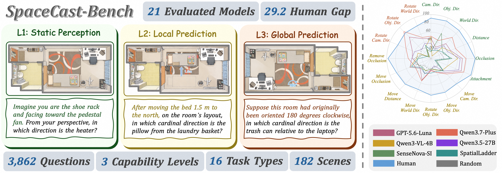
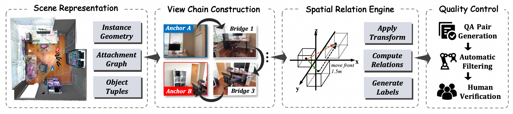
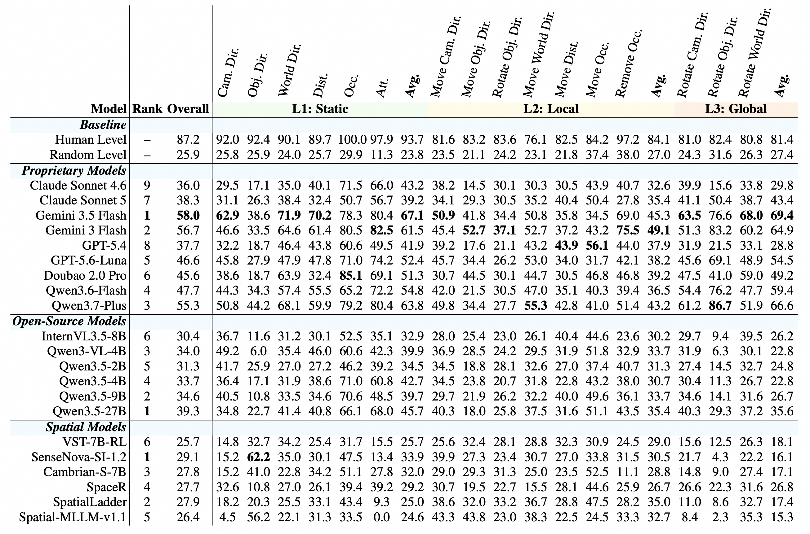
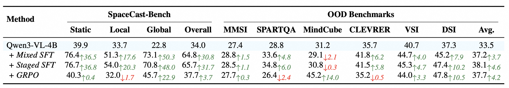

<h1 align="center">
SpaceCast-Bench: Evaluating Predictive Spatial Reasoning in Vision-Language Models
</h1>

<div align="center">
  <p>
    <a href="https://arxiv.org/pdf/2610.12402" target="_blank">
      
    </a>
    <a href="https://huggingface.co/datasets/hongxingli/SpaceCast-Bench" target="_blank">
      
    </a>
  </p>
</div>

## 🔥 Overview

We introduce **SpaceCast-Bench**, a benchmark for **predictive spatial reasoning**: observing a scene, anticipating how an intervention changes it, and reasoning about the unseen outcome. It comprises **3,862 questions** from **182 real-world scenes**, spanning **16 task types** across three capability levels: static perception, local prediction, and global prediction.

<p align="center">
  
</p>

Built around an **observe–transform–infer** framework, our geometry-grounded pipeline connects observations through depth-verified view chains, applies controlled 3D transformations, and derives labels programmatically. Models see only the initial scene and must infer spatial relations in the unobserved outcome.

<p align="center">
  
</p>

Evaluation of **21 models** reveals a substantial gap: the strongest evaluated baseline reaches **58.0%**, compared with **87.2%** human performance, while spatially specialized models remain near random chance. Overall scores are macro-averaged across the 16 task types.

<p align="center">
  
</p>

Staged supervised fine-tuning on our generated data raises Qwen3-VL-4B from **34.0% to 65.7%** on SpaceCast-Bench and improves its macro-average score across six out-of-domain benchmarks from **33.5% to 38.1%**.

<p align="center">
  
</p>

## 🎉 News

- **[2026/10/09]** Our [paper](https://arxiv.org/pdf/2610.12402) is now available on arXiv.

- **[2026/10/08]** We release our [code](https://github.com/ZJU-REAL/SpaceCast-Bench) and [dataset](https://huggingface.co/datasets/hongxingli/SpaceCast-Bench) for SpaceCast-Bench.

## 📖 Usage

### Environment Installation

Clone the repository and install the dependencies:

```bash
git clone https://github.com/ZJU-REAL/SpaceCast-Bench.git
cd SpaceCast-Bench

conda create -n spacecast python=3.10 -y
conda activate spacecast

pip install -r requirements.txt
```

Evaluation runs through an OpenAI-compatible endpoint or the Anthropic API. For locally hosted models, start an OpenAI-compatible inference service such as vLLM or SGLang separately; the evaluation client does not require a GPU.

### Evaluation

The benchmark is automatically downloaded and cached from [Hugging Face](https://huggingface.co/datasets/hongxingli/SpaceCast-Bench) on the first run.

Set the API endpoint, key, and model name to match your inference service:

```bash
export OPENAI_BASE_URL="YOUR_API_BASE_URL"
export OPENAI_API_KEY="YOUR_API_KEY"
export MODEL_NAME="YOUR_MODEL_NAME"
```

Run evaluation with either chain-of-thought reasoning (`cot`) or direct answers (`direct`):

```bash
# Chain-of-thought evaluation
python evaluate.py \
    --dataset hongxingli/SpaceCast-Bench \
    --mode cot \
    --model "$MODEL_NAME" \
    --output-dir outputs/cot

# Direct-answer evaluation
python evaluate.py \
    --dataset hongxingli/SpaceCast-Bench \
    --mode direct \
    --model "$MODEL_NAME" \
    --output-dir outputs/direct
```

> **Note:** Use a separate output directory for each model and evaluation mode. Add `--limit 10` for a quick check. To continue an interrupted run, repeat the same command with `--resume`; add `--retry-errors` to retry previously failed questions. For the Anthropic API, add `--api-provider anthropic` and set `ANTHROPIC_BASE_URL` and `ANTHROPIC_API_KEY` instead.

Predictions and scores are saved in the output directory as `predictions.jsonl`, `report.json`, and `per_question.jsonl`, alongside the run settings in `run_config.json`. The main benchmark metric is `macro_type_accuracy`, averaged across all 16 task types; it is reported only for the complete benchmark.

To score an existing prediction file without running inference again:

```bash
python score.py \
    --dataset hongxingli/SpaceCast-Bench \
    --predictions outputs/cot/predictions.jsonl \
    --output-dir outputs/cot_rescored
```

## 🙏 Acknowledgement

This benchmark builds on [ScanNet](https://www.scan-net.org/) and [ScanNet++](https://scannetpp.mlsg.cit.tum.de/scannetpp/). We thank the authors for making their datasets available to the research community.

## ⭐️ Citation

If you find SpaceCast-Bench useful, please consider citing our work:

```bibtex
@misc{li2026spacecastbenchevaluatingpredictivespatial,
      title={SpaceCast-Bench: Evaluating Predictive Spatial Reasoning in Vision-Language Models},
      author={Hongxing Li and Jinyue Su and Dingming Li and Wenqi Zhang and Weiming Lu and Jun Xiao and Yueting Zhuang and Yongliang Shen},
      year={2026},
      eprint={2610.12402},
      archivePrefix={arXiv},
      primaryClass={cs.CV},
      url={https://arxiv.org/abs/2610.12402},
}
```
